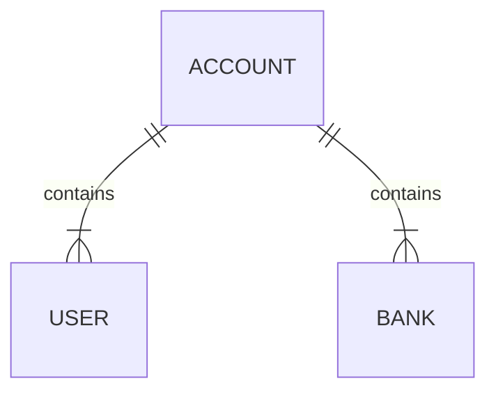

# Api's

Different implementation of API's, in different languages and frameworks. All of them follow the same schema, implemented in defferent ways, also, they have the same end points, such as:

```console
# GET
http://localhost:{port}/api/user/
http://localhost:{port}/api/user/:id

# POST
http://localhost:{port}/api/user/

# UPDATE
http://localhost:{port}/api/user/:id

# DELETE
http://localhost:{port}/api/user/:id
```

They are separated each one in it's own folder, and also there is a [SQL files folder](https://github.com/rafaeltxc/Api-s/tree/main/dataBase) that contains the codes for creating the database (OracleSQL, MySQL and PostgreSQL ddl's).

### DataBase structure:


