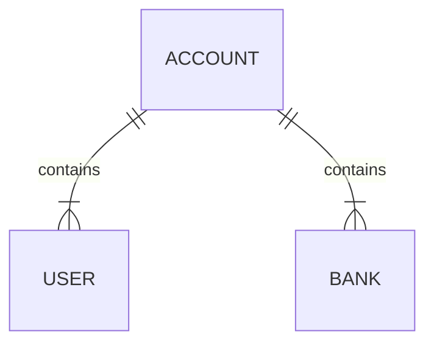

# Api's

The api's are separated each one in it's own folder, in different languages and frameworks.

There's also a [SQL files folder](https://github.com/rafaeltxc/Api-s/tree/main/dataBase) that contains the code for creating the database in OracleSQL, MySQL and Postgre

### DataBase structure:

