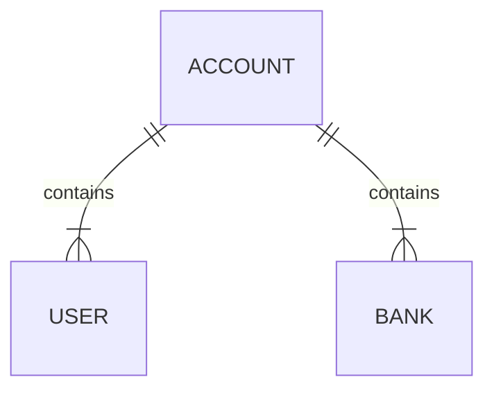

# Api's

The api's are separated each one in it's own branch, in different languages or frameworks.

All of them follow the same dataBase structure:

```mermaid
erDiagram
  ACCOUNT ||--|{ USER : contains
  ACCOUNT ||--|{ BANK : contains
  
```
